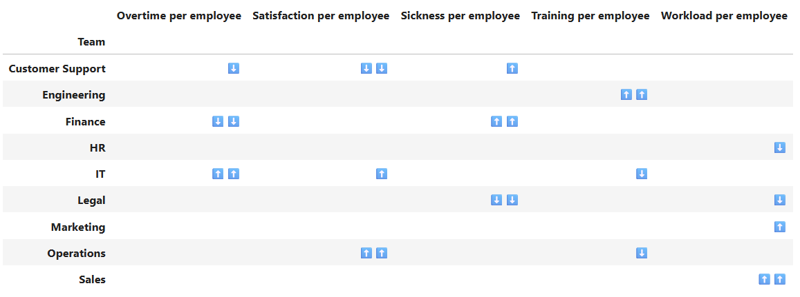

# Compare Team/Department Performance using Z-scores

This repository demonstrates how Z-scores are used to compare relative team performance on various metrics.




## Getting Started

### Dependencies

* pandas
* numpy
* scipy
* statsmodels
* matplotlib

### Usage

Simply, run ```main.ipynb```to compare team/department performance on available metrics. 

More metrics can be added easily by following the factory design pattern in ```Metric.py``` and custom logic can be implemented as desired.

For this example, we did not perform any transofrmation on the normalised metrics because qqplot show that all of the metric roughly follow the normal distrbution. 
 
### Explaination

The arrows indicate how extreme the outliers are in terms of their Z-scores.

⬆️⬆️⬆️ = x > 1.96\
⬆️⬆️ = x > 1.5\
⬆️ = x > 1\
⬇️ = x < -1\
⬇️⬇️ = x < -1.5\
⬇️⬇️⬇️ = x < -1.96

## Acknowledgments

Dataset is provided by 
* [Original Python code](https://www.kaggle.com/code/jirkaborovec/cctv-weapon-train-yolo-detection)
* [Dataset](https://www.kaggle.com/datasets/simuletic/cctv-weapon-dataset)
